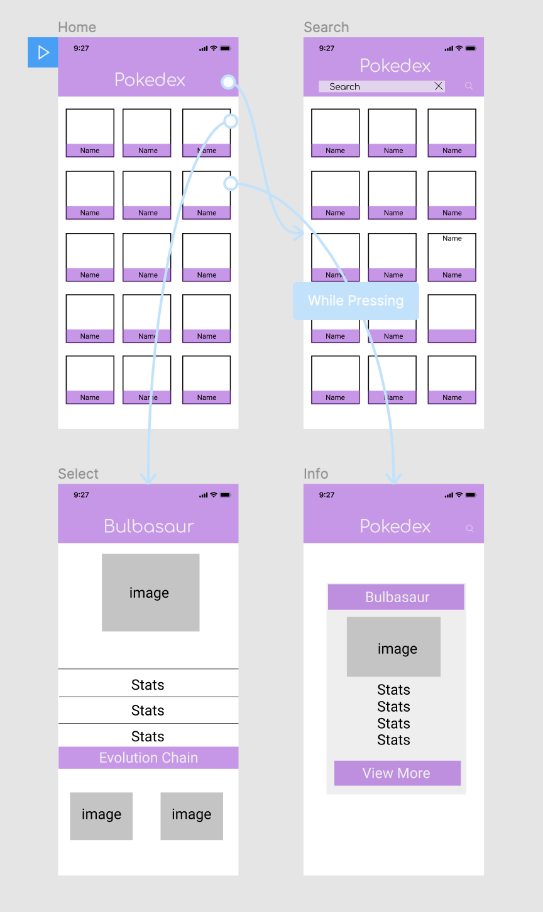

# CSC-690-Final-Project

``` 
Members: Aaron Li
```

```
Proposal: Pokedex Application (1st Generation)
              
  Must Have Features: 
                      Search for an specific Pokemon based off name
                      Able to browse and access multiple pages
                      Retrieve pokemon information from API
                      Displaying correct images and names of Pokemon
                      Hold Feature that displays an pop up 
                      Displays Data/Stats/Description and Evolution of Pokemon 
            
  Nice to Have Features: 
                         Using a different API or source for getting other Generations
                         Having Background Music 
                         Filter Options to Search/Find an specific Pokemon easier
                         Favorite Option 
                       
```

```
WireFrame
```



```
Demo
```


